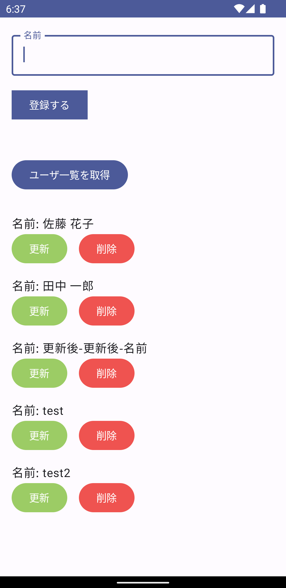

# Front App

Androidからバックエンド側のAPIのコールを想定した、簡単なユーザ管理アプリケーションです。
短期間での構築を前提のため粗はあるかもしれませんが、API通信、JetpackCompose、Spring Boot と絡める等、業務や自己的に見てきた技術を披露することを目的に作成しました。

## Features
- ユーザ情報のCRUD操作(新規作成 / 一覧表示 / 編集 / 削除)
- Spring Boot と連携した REST API通信
- Jetpack Compose
- MVVM + Repositoryアーキテクチャ
- 非同期処理
- 単体テストを一部実装

## 画面イメージ

### ユーザー一覧画面

### 登録後の画面

## 技術スタック
- **フロントエンド** Kotlin(Jetpack Compose), Android
- **バックエンド** Spring Boot, MySQL
- **通信** REST API, OkHttp
- **状態管理** ViewModel
- **テスト** JUnit4, Coroutine Test

## 工夫したポイント
- **MVVM アーキテクチャ**を採用し、保守性と拡張性を向上。
- **StateFlow + Coroutine** によって、UIと状態更新の同期を簡潔に実現。
- **ユニットテスト**を導入し、ViewModel の単体テストを通じて信頼性を高めました。
- UI は **Jetpack Compose** を使い、宣言的な UI 実装を実現。
- バックエンド側の経験もあったため、Androidと絡めてバックエンド側も実装しました。

## 参考にした情報
- [Jetpack Compose 公式ガイド](https://developer.android.com/jetpack/compose/documentation)
- [StateFlow と ViewModel の使い方](https://developer.android.com/kotlin/flow/stateflow-and-sharedflow)
- [UnitTest](https://developer.android.com/kotlin/coroutines/test?hl=ja)

## 起動方法(ローカル)

### バックエンド
1. `application.properties` で MySQL の接続情報を設定
2. IntelliJ IDEA で `DemoApplication` を実行

### フロントエンド（Android）
1. Android Studio でプロジェクトを開く
2. エミュレーター または 実機で起動